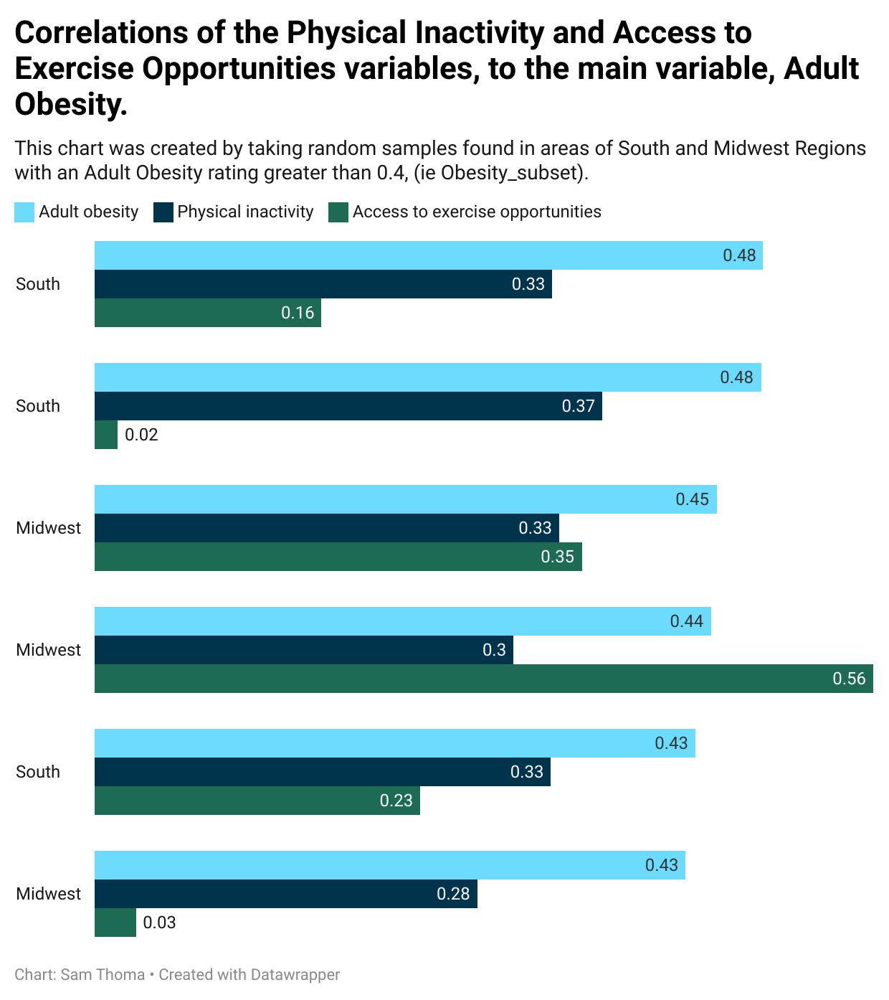

# ST-ENGL105Repository
##### Repository containing the main dataset, smaller subset, python notebook, and instructional data. This was created in the ENGL105 class at the University of North Carolina at Chapel Hill.
##### The repository was focuses on the creation of a subset of data, coming from a larger dataset known as "County Health Data". Throughout the creation of this subset, you will be investigating any correlation between several variables, and the main variable, Adult Obseity. The purpose of such subset being to learn how to code its creation, and develop an instructional understanding.
##### This repository is for any individual who is willing to learn how to code and create a notebook for their own benefit. After utlizing the repository, users are able to reproduce the data in any way they see fit for their journey in learning about python basics.

## Chart provided with finished subset data:

